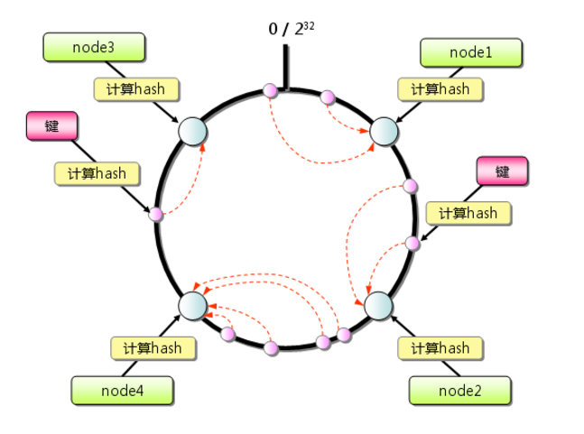

# 一、概述

**Memcached**(http://memcached.org/)是⼀一款开源免费的，⾼高性能的分布式内存对象缓存系统。
**Memcached**是⼀一种基于内存的`key`-`value`存储，⽤用来存储⼩小块的任意数据（字符串串、对象）。
**Memcached**简洁⽽而强⼤大。它的简洁设计便便于快速开发，减轻开发难度，解决了了⼤大数据量量缓存的很多
问题。它的API兼容⼤大部分流⾏行行的开发语⾔言。


# 二、环境搭建

## 1. 安装

```bash
# Linux系统安装memcached，首先要先安装libevent库
[root@cache ~]# yum install libevent-devel -y

[root@cache ~]# tar -zxvf memcached-1.4.31.tar.gz
[root@cache ~]# cd memcached-1.4.31
# 指定memcached安装⽬目录
[root@cache memcached-1.4.31]# ./configure --prefix=/usr/local/memcached

# 如果出现以下日志，说明需要gcc环境
checking for gcc... no
checking for cc... no
checking for cl.exe... no
configure: error: in `/root/memcached-1.4.31':
configure: error: no acceptable C compiler found in $PATH
# 安装gcc环境，再次安装
[root@cache memcached-1.4.31]# yum install gcc -y
[root@cache memcached-1.4.31]# ./configure --prefix=/usr/local/memcached

[root@cache memcached-1.4.31]# make && make install
# 安装完成
```

+ 参数说明

```bash
[root@cache memcached-1.4.31]# cd /usr/local/memcached/bin
# 帮助命令
memcached 1.4.31
# ---------------------参数说明----------------------
-p <num> TCP端⼝口，默认为11211，可以不不设置
-l <addr> 监听的 IP 地址，本机可以不不设置此参数
-d 以守护程序（daemon）⽅方式运⾏行行
-u 指定⽤用户，如果当前为 root ，需要使⽤用此参数指定⽤用户
-m <num> 最⼤大内存使⽤用，单位MB。默认64MB
-M 禁⽌止LRU策略略，内存耗尽时返回错误，⽽而不不是删除项
-c <num> 最⼤大同时连接数，默认是1024
-t <num> 线程数，默认4。由于memcached采⽤用NIO，所以更更多线程没有太多作⽤用
-v 日志(错误和警告)
-vv 日志(错误、警告、客户端命令和响应)
-vvv ⾮非常详细的日志
```

+ 启动

```bash
[root@cache bin]# ./memcached -m 128mb -vv -u root
```

+ 命令

Memcached可以通过 telnet 命令并指定主机ip和端⼝口来连接 Memcached 服务
如： `telnet HOST PORT`

+ 安装telnet命令

```bash
 yum list telnet*              列出telnet相关的安装包
 yum install telnet-server -y         安装telnet服务
 yum install telnet.* -y         安装telnet客户端
```

## 2. 语法

set 命令的基本语法格式如下：

```bash
set key flags exptime bytes [noreply] 
value 
```

参数说明如下：

- **key：**键值 key-value 结构中的 key，用于查找缓存值。
- **flags**：可以包括键值对的整型参数，客户机使用它存储关于键值对的额外信息 。
- **exptime**：在缓存中保存键值对的时间长度（以秒为单位，0 表示永远）
- **bytes**：在缓存中存储的字节数
- **noreply（可选）**： 该参数告知服务器不需要返回数据
- **value**：存储的值（始终位于第二行）（可直接理解为key-value结构中的value）

**实例**

以下实例中我们设置：

- key → cache
- flag → 0
- exptime → 900 (以秒为单位)
- bytes → 9 (数据存储的字节数)
- value → memcached

```
set runoob 0 900 9
memcached
STORED

get runoob
VALUE runoob 0 9
memcached

END
```

**输出**

如果数据设置成功，则输出：

```
STORED
```

输出信息说明：

- **STORED**：保存成功后输出。
- **ERROR**：在保存失败后输出。

# 三、Java客户端(XMemcached)

XMemcached是基于Java NIO的Memcached客户端，Java NIO相⽐比于传统阻塞io模型来说，有效率高（特别在高并发下）和资源耗费相对较少的优点。

特性

> 高性能
> 支持完整的协议
> 支持客户端分布
> 动态增删节点
> 允许设置节点权重

Maven坐标

```xml
<dependency>
    <groupId>com.googlecode.xmemcached</groupId>
    <artifactId>xmemcached</artifactId>
    <version>2.0.0</version>
</dependency>
<dependency>
    <groupId>org.slf4j</groupId>
    <artifactId>slf4j-api</artifactId>
    <version>1.7.2</version>
    <scope>compile</scope>
</dependency>
<dependency>
    <groupId>org.slf4j</groupId>
    <artifactId>slf4j-log4j12</artifactId>
    <version>1.7.2</version>
    <scope>compile</scope>
</dependency>
```

## 1. API Demo

```java
/**
 * @Author LeeHao
 * @Date 2019/5/22 08:48
 * @Description：
 */
public class Demo {
    public static final Logger logger= LoggerFactory.getLogger(Demo.class);
    public static void main(String[] args) {
        MemcachedClientBuilder builder = new XMemcachedClientBuilder(AddrUtil.getAddresses("cache:11211"));
        // 多个Memcached Server：host1:port1host2:port2

        try {
            MemcachedClient memcachedClient = builder.build();
            // 存储数据 参数⼀一：key名 参数⼆二：expire时间（单位秒）表示永久存储（默认是⼀一个月）参数三：value值
            memcachedClient.set("hello", 1000, "Hello,xmemcached");
            // 获取数据
            String value = memcachedClient.get("hello");
            logger.info("删除前：key：hello--> value：" + value);
            // 删除数据
            memcachedClient.delete("hello");
            value = memcachedClient.get("hello");
            logger.info("删除后：key：hello--> value：" + value);
        } catch (IOException e) {
            e.printStackTrace();
        } catch (TimeoutException e) {
            e.printStackTrace();
        } catch (InterruptedException e) {
            e.printStackTrace();
        } catch (MemcachedException e) {
            e.printStackTrace();
        }

    }
}
```

## 2. Spring集成

+ maven依赖(需要log4j.properties文件)

```xml
<dependency>
    <groupId>com.googlecode.xmemcached</groupId>
    <artifactId>xmemcached</artifactId>
    <version>2.0.0</version>
</dependency>
<dependency>
    <groupId>org.slf4j</groupId>
    <artifactId>slf4j-api</artifactId>
    <version>1.7.2</version>
    <scope>compile</scope>
</dependency>
<dependency>
    <groupId>org.slf4j</groupId>
    <artifactId>slf4j-log4j12</artifactId>
    <version>1.7.2</version>
    <scope>compile</scope>
</dependency>
```

+ xmemcached.properties配置文件： 

```properties
#连接池大小即客户端个数
memcached.connectionPoolSize=1
memcached.failureMode=true
#server1
memcached.server1.host=cache
memcached.server1.port=11211
memcached.server1.weight=1
```

+ applicationContext-xmemcached.xml配置文件（spring主文件要引入该文件）：

```xml
<?xml version="1.0" encoding="UTF-8"?>
<beans xmlns="http://www.springframework.org/schema/beans"
       xmlns:xsi="http://www.w3.org/2001/XMLSchema-instance" xmlns:mvc="http://www.springframework.org/schema/mvc"
       xmlns:context="http://www.springframework.org/schema/context"
       xmlns:tx="http://www.springframework.org/schema/tx" xmlns:task="http://www.springframework.org/schema/task"
       xmlns:aop="http://www.springframework.org/schema/aop"
       xsi:schemaLocation="
        http://www.springframework.org/schema/mvc http://www.springframework.org/schema/mvc/spring-mvc-3.1.xsd
        http://www.springframework.org/schema/beans http://www.springframework.org/schema/beans/spring-beans-3.1.xsd
        http://www.springframework.org/schema/context http://www.springframework.org/schema/context/spring-context-3.1.xsd
      http://www.springframework.org/schema/tx http://www.springframework.org/schema/tx/spring-tx-3.1.xsd
      http://www.springframework.org/schema/task http://www.springframework.org/schema/task/spring-task-3.1.xsd
       http://www.springframework.org/schema/aop
        http://www.springframework.org/schema/aop/spring-aop-3.0.xsd ">
    <!-- properties config   -->
    <bean class="org.springframework.beans.factory.config.PropertyPlaceholderConfigurer">
        <property name="order" value="1"/>
        <property name="ignoreUnresolvablePlaceholders" value="true"/>
        <property name="locations">
            <list>
                <value>classpath:/xmemcached.properties</value>
            </list>
        </property>
    </bean>
    <!-- Memcached配置 -->
    <!-- p:connectionPoolSize="${memcached.connectionPoolSize}"   p:failureMode="${memcached.failureMode}" -->
    <bean   id="memcachedClientBuilder" class="net.rubyeye.xmemcached.XMemcachedClientBuilder">
        <constructor-arg>
            <list>
                <bean class="java.net.InetSocketAddress">
                    <constructor-arg>
                        <value>${memcached.server1.host}</value>
                    </constructor-arg>
                    <constructor-arg>
                        <value>${memcached.server1.port}</value>
                    </constructor-arg>
                </bean>
            </list>
        </constructor-arg>
        <constructor-arg>
            <list>
                <value>${memcached.server1.weight}</value>
            </list>
        </constructor-arg>
        <property name="commandFactory" >
            <bean class="net.rubyeye.xmemcached.command.TextCommandFactory" />
        </property>
        <property name="sessionLocator" >
            <bean class="net.rubyeye.xmemcached.impl.KetamaMemcachedSessionLocator" />
        </property>
        <property name="transcoder" >
            <bean class="net.rubyeye.xmemcached.transcoders.SerializingTranscoder" />
        </property>
        <property name="connectionPoolSize" value="${memcached.connectionPoolSize}" />
        <property name="failureMode" value="${memcached.failureMode}" />
    </bean>
    <!-- Use factory bean to build memcached client -->
    <bean id="memcachedClient" factory-bean="memcachedClientBuilder" factory-method="build"  destroy-method="shutdown" />
</beans>
```

+ 测试类

```java
@RunWith(SpringJUnit4ClassRunner.class)
@ContextConfiguration("classpath:spring/applicationContext.xml")
public class TestXMemcached {

    @Autowired
    private MemcachedClient memcachedClient;

    @Test
    public void test() {
        try {
            // 设置/获取
            memcachedClient.set("zlex", 36000, "set/get");
            System.out.println(memcachedClient.get("zlex"));
            // 替换
            memcachedClient.replace("zlex", 36000, "replace");
            System.out.println(memcachedClient.get("zlex"));
            // 移除
            memcachedClient.delete("zlex");
            System.out.println(memcachedClient.get("zlex"));
        } catch (Exception e) {
            e.printStackTrace();
        }
    }
}
```

+ 测试结果

```bash
WARN [Xmemcached-Reactor-0] - Add a session: 192.168.88.131:11211
set/get
replace
null
WARN [Thread-10] - Client in failure mode,we don't remove session 192.168.88.131:11211
```


## 3. SpringBoot集成

+ maven依赖

```xml
<dependency>
    <groupId>org.projectlombok</groupId>
    <artifactId>lombok</artifactId>
    <version>1.18.4</version>
</dependency>
<dependency>
    <groupId>org.springframework.boot</groupId>
    <artifactId>spring-boot-starter</artifactId>
</dependency>
<dependency>
    <groupId>org.springframework.boot</groupId>
    <artifactId>spring-boot-starter-test</artifactId>
    <scope>test</scope>
</dependency>
<dependency>
    <groupId>com.googlecode.xmemcached</groupId>
    <artifactId>xmemcached</artifactId>
    <version>2.0.0</version>
</dependency>
<dependency>
    <groupId>org.springframework.boot</groupId>
    <artifactId>spring-boot-configuration-processor</artifactId>
    <optional>true</optional>
</dependency>
```

+ application.yml配置文件

```yaml
memcached:
  #服务节点
  servers: cache:11211
  #连接池数量
  poolSize: 5
  #是否启用url  encode机制
  sanitizeKeys: false
```

+ yml文件解析

因为springboot没有集成memcached，所有要自己解析yml文件

```java
@Data
@Component
@ConfigurationProperties(prefix = "memcached")
public class MemcachedProperties {
    private String servers;
    private Integer poolSize;
    private boolean sanitizeKeys;
}
```

+ memcached的config类

先构建MemcachedClientBuilder类，实际和Spring整合类似，参数都一样，再构建MemcachedClient

```java
@Configuration
public class MemcachedConfig {

    @Autowired
    private MemcachedProperties properties;

    //创建MemcachedClientBuilder，和spring配置文件类型
    @Bean
    public MemcachedClientBuilder memcachedClientBuilder(){
        MemcachedClientBuilder builder = new XMemcachedClientBuilder(properties.getServers());
        //设置连接池个数
        builder.setConnectionPoolSize(properties.getPoolSize());
        //设置失败模式
        builder.setFailureMode(false);
        builder.setSanitizeKeys(properties.isSanitizeKeys());
        builder.setCommandFactory(new BinaryCommandFactory());
        builder.setSessionLocator(new KetamaMemcachedSessionLocator());
        builder.setOpTimeout(3000);

        return builder;
    }

    @Bean
    public MemcachedClient memcachedClient(MemcachedClientBuilder builder){
        MemcachedClient client= null;
        try {
            client = builder.build();
//            client.shutdown();
        } catch (IOException e) {
            e.printStackTrace();
        }
        return client;
    }

}
```

+ 测试

```java
@RunWith(SpringJUnit4ClassRunner.class)
@SpringBootTest(classes = MemcachedApplication.class)
public class TestMemcached {

    @Autowired
    private MemcachedClient client;

    @Test
    public void test() {
        try {
            // 设置/获取
            client.set("cache", 36000, "set/get");
            System.out.println("get结果："+client.get("cache"));
            // 替换
            client.replace("cache", 36000, "replace");
            System.out.println("replace后："+client.get("cache"));
            // 移除
            client.delete("cache");
            System.out.println("delete后："+client.get("cache"));
        } catch (Exception e) {
            e.printStackTrace();
        }
    }
}
```

## 4. CAS操作

Memcached是通过CAS协议实现原⼦更新，所谓原⼦更新就是compare and set，原理类似乐观锁，每次请求存储某个数据同时要附带一个CAS值，memcached⽐比对这个CAS值与当前存储数据的CAS值是否相等，如果相等就让新的数据覆盖老的数据，如果不相等就认为更新失败，这在并发环境下特别有用。
CAS协议其实是分为两个步骤：获取CAS值和尝试更新

```java
GetsResponse<Integer> result = client.gets("a");
long cas = result.getCas();
//尝试将a的值更更新为2
if (!client.cas("a", 0, 2, cas)) {
System.err.println("cas error");
}
```

## 5. 命名空间

从1.4.2开始，xmemcached提供了了memcached命名空间的封装使用，你可以将⼀组缓存项放到同一个命名空间下，可以让整个命名空间下所有的缓存项同时失效。

```java
String ns = "namespace" ;
this.memcachedClient.withNamespace(ns,new MemcachedClientCallable<Void>() {
    public Void call(MemcachedClient client) throws MemcachedException, 
            InterruptedException,TimeoutException {
                //a,b,c都在namespace下
                client.set("a",1);
                client.set("b",1);
                client.set("c",1);
                return null;
            }
});
//获取命名空间内的a对应的值
Integer aValue = this.memcachedClient.withNamespace(ns,new MemcachedClientCallable<Integer>() {
    public Integer call(MemcachedClient client) throws MemcachedException, InterruptedException,
    TimeoutException {
        return client.get("a");
    }
});
//使得命名空间失效
this.memcachedClient.invalidateNamespace(ns);
```


# 四、应用

## 1. 分布式集群

Memcached的分布是通过客户端实现的，客户端根据key的哈希值得到将要存储的memcached节点，并将对应的value存储到相应的节点。


### 1.1 余数算法（默认）

+ 按照key的哈希值模以连接数得到的余数，对应的连接就是将要存储的节点

  `key.hashCode() % nodeCount = nodeIndex`

+ 缺点：如果服务器数量发生变化，所有的服务器的缓存在同一时间失效，会导致所有压力都在一个时

  间集中到数据库服务器上。

### 1.2 一致性哈希

一致性哈希算法在1997年由麻省理工学院的Karger等人在解决分布式Cache中提出的，设计目标是为了解决因特网中的热点(Hot spot)问题，初衷和CARP十分类似。一致性哈希修正了CARP使用的简单哈希算法带来的问题，使得DHT可以在P2P环境中真正得到应用。

　　但现在一致性hash算法在分布式系统中也得到了广泛应用，研究过memcached缓存数据库的人都知道，memcached服务器端本身不提供分布式cache的一致性，而是由客户端来提供，具体在计算一致性hash时采用如下步骤：

1. 首先求出memcached服务器（节点）的哈希值，并将其配置到0～232的圆（continuum）上。
2. 然后采用同样的方法求出存储数据的键的哈希值，并映射到相同的圆上。
3. 然后从数据映射到的位置开始顺时针查找，将数据保存到找到的第一个服务器上。如果超过232仍然找不到服务器，就会保存到第一台memcached服务器上。



从上图的状态中添加一台memcached服务器。余数分布式算法由于保存键的服务器会发生巨大变化而影响缓存的命中率，但Consistent Hashing中，只有在园（continuum）上增加服务器的地点逆时针方向的第一台服务器上的键会受到影响，如下图所示： 


### 1.3 一致性Hash性质

　　考虑到分布式系统每个节点都有可能失效，并且新的节点很可能动态的增加进来，如何保证当系统的节点数目发生变化时仍然能够对外提供良好的服务，这是值得考虑的，尤其实在设计分布式缓存系统时，如果某台服务器失效，对于整个系统来说如果不采用合适的算法来保证一致性，那么缓存于系统中的所有数据都可能会失效（即由于系统节点数目变少，客户端在请求某一对象时需要重新计算其hash值（通常与系统中的节点数目有关），由于hash值已经改变，所以很可能找不到保存该对象的服务器节点），因此一致性hash就显得至关重要，良好的分布式cahce系统中的一致性hash算法应该满足以下几个方面：

- **平衡性(Balance)**

平衡性是指哈希的结果能够尽可能分布到所有的缓冲中去，这样可以使得所有的缓冲空间都得到利用。很多哈希算法都能够满足这一条件。

- **单调性(Monotonicity)**

单调性是指如果已经有一些内容通过哈希分派到了相应的缓冲中，又有新的缓冲区加入到系统中，那么哈希的结果应能够保证原有已分配的内容可以被映射到新的缓冲区中去，而不会被映射到旧的缓冲集合中的其他缓冲区。简单的哈希算法往往不能满足单调性的要求，如最简单的线性哈希：x = (ax + b) mod (P)，在上式中，P表示全部缓冲的大小。不难看出，当缓冲大小发生变化时(从P1到P2)，原来所有的哈希结果均会发生变化，从而不满足单调性的要求。哈希结果的变化意味着当缓冲空间发生变化时，所有的映射关系需要在系统内全部更新。而在P2P系统内，缓冲的变化等价于Peer加入或退出系统，这一情况在P2P系统中会频繁发生，因此会带来极大计算和传输负荷。单调性就是要求哈希算法能够应对这种情况。

- **分散性(Spread)**

在分布式环境中，终端有可能看不到所有的缓冲，而是只能看到其中的一部分。当终端希望通过哈希过程将内容映射到缓冲上时，由于不同终端所见的缓冲范围有可能不同，从而导致哈希的结果不一致，最终的结果是相同的内容被不同的终端映射到不同的缓冲区中。这种情况显然是应该避免的，因为它导致相同内容被存储到不同缓冲中去，降低了系统存储的效率。分散性的定义就是上述情况发生的严重程度。好的哈希算法应能够尽量避免不一致的情况发生，也就是尽量降低分散性。

- **负载(Load)**

负载问题实际上是从另一个角度看待分散性问题。既然不同的终端可能将相同的内容映射到不同的缓冲区中，那么对于一个特定的缓冲区而言，也可能被不同的用户映射为不同的内容。与分散性一样，这种情况也是应当避免的，因此好的哈希算法应能够尽量降低缓冲的负荷。

- **平滑性(Smoothness)**

平滑性是指缓存服务器的数目平滑改变和缓存对象的平滑改变是一致的。

### 1.4 一致性哈希原理

**基本概念**

　　一致性哈希算法（Consistent Hashing）最早在论文《[Consistent Hashing and Random Trees: Distributed Caching Protocols for Relieving Hot Spots on the World Wide Web](http://dl.acm.org/citation.cfm?id=258660)》中被提出。简单来说，一致性哈希将整个哈希值空间组织成一个虚拟的圆环，如假设某哈希函数H的值空间为0-2^32-1（即哈希值是一个32位无符号整形），整个哈希空间环如下：


整个空间按顺时针方向组织。0和232-1在零点中方向重合。

　　下一步将各个服务器使用Hash进行一个哈希，具体可以选择服务器的ip或主机名作为关键字进行哈希，这样每台机器就能确定其在哈希环上的位置，这里假设将上文中四台服务器使用ip地址哈希后在环空间的位置如下：


接下来使用如下算法定位数据访问到相应服务器：将数据key使用相同的函数Hash计算出哈希值，并确定此数据在环上的位置，从此位置沿环顺时针“行走”，第一台遇到的服务器就是其应该定位到的服务器。

　　例如我们有Object A、Object B、Object C、Object D四个数据对象，经过哈希计算后，在环空间上的位置如下：


根据一致性哈希算法，数据A会被定为到Node A上，B被定为到Node B上，C被定为到Node C上，D被定为到Node D上。

下面分析一致性哈希算法的容错性和可扩展性。现假设Node C不幸宕机，可以看到此时对象A、B、D不会受到影响，只有C对象被重定位到Node D。一般的，在一致性哈希算法中，如果一台服务器不可用，则受影响的数据仅仅是此服务器到其环空间中前一台服务器（即沿着逆时针方向行走遇到的第一台服务器）之间数据，其它不会受到影响。

下面考虑另外一种情况，如果在系统中增加一台服务器Node X，如下图所示：


此时对象Object A、B、D不受影响，只有对象C需要重定位到新的Node X 。一般的，在一致性哈希算法中，如果增加一台服务器，则受影响的数据仅仅是新服务器到其环空间中前一台服务器（即沿着逆时针方向行走遇到的第一台服务器）之间数据，其它数据也不会受到影响。

综上所述，一致性哈希算法对于节点的增减都只需重定位环空间中的一小部分数据，具有较好的容错性和可扩展性。

另外，一致性哈希算法在服务节点太少时，容易因为节点分部不均匀而造成数据倾斜问题。例如系统中只有两台服务器，其环分布如下:


此时必然造成大量数据集中到Node A上，而只有极少量会定位到Node B上。为了解决这种数据倾斜问题，一致性哈希算法引入了虚拟节点机制，即对每一个服务节点计算多个哈希，每个计算结果位置都放置一个此服务节点，称为虚拟节点。具体做法可以在服务器ip或主机名的后面增加编号来实现。例如上面的情况，可以为每台服务器计算三个虚拟节点，于是可以分别计算 “Node A#1”、“Node A#2”、“Node A#3”、“Node B#1”、“Node B#2”、“Node B#3”的哈希值，于是形成六个虚拟节点： 


同时数据定位算法不变，只是多了一步虚拟节点到实际节点的映射，例如定位到“Node A#1”、“Node A#2”、“Node A#3”三个虚拟节点的数据均定位到Node A上。这样就解决了服务节点少时数据倾斜的问题。在实际应用中，通常将虚拟节点数设置为32甚至更大，因此即使很少的服务节点也能做到相对均匀的数据分布。 

## 2. 数据库缓存

如：使⽤用Memcached管理理Mybatis⼆二级缓存，构建分布式缓存

+ maven依赖

```xml
<!-- mybatis整合memcache -->
<dependency>
    <groupId>org.mybatis.caches</groupId>
    <artifactId>mybatis-memcached</artifactId>
    <version>1.0.0</version>
</dependency>
```

+ mapper中开启缓存

```xml
<mapper namespace="com.hzbank.spring.dao.UserDao">
    <!--开启二级缓存，交给memcached管理-->
    <cache type="org.mybatis.caches.memcached.LoggingMemcachedCache" />	
    <!--二选一，无日志方式-->
    <cache type="org.mybatis.caches.memcached.MemcachedCache" />	
</mapper>
```

+ classpath下新建memcached.properties文件，格式如下： 

```properties
# 缓存key的前缀
org.mybatis.caches.memcached.keyprefix=_mybatis_
#memcache地址 ${host}:${port}
org.mybatis.caches.memcached.servers=cache:11211
#连接工程，Any class that implementsnet.spy.memcached.ConnectionFactory
org.mybatis.caches.memcached.connectionfactory=net.spy.memcached.DefaultConnectionFactory
#过期时间 默认30天，单位秒
org.mybatis.caches.memcached.expiration=6000
#是否启用异步读
org.mybatis.caches.memcached.asyncget=false
#使用异步读的timeout时间
org.mybatis.caches.memcached.timeout=5
#使用异步读的timeout时间单位
org.mybatis.caches.memcached.timeoutunit=java.util.concurrent.TimeUnit.SECONDS
#i如果开启，对象在放到memcache前会使用GZIP 压缩
org.mybatis.caches.memcached.compression=false

#refuse time when connection refused
org.mybatis.caches.memcached.refuseperiod=1000
```


