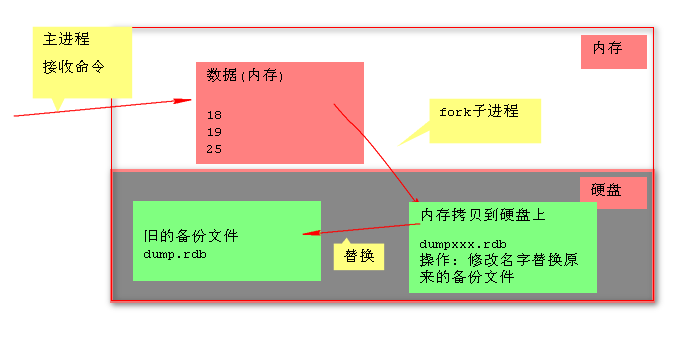
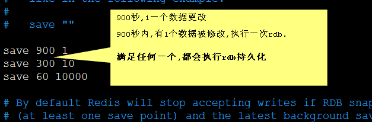
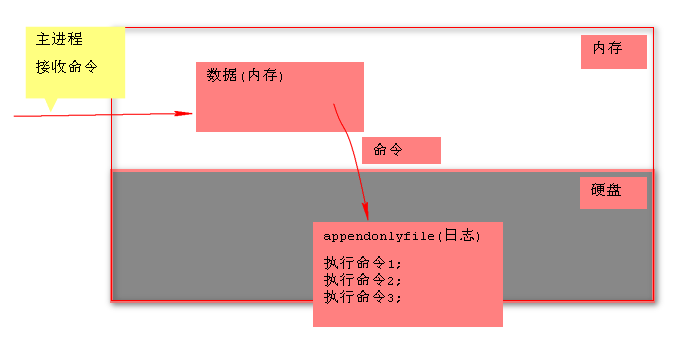

# 一、前言

核心: 基于内存读写操作的数据库.

简介: Redis是使用C语言编写的数据库, NoSQL数据库, 使用key-value的形式保存数据

> ​	not only sql: (非关系型数据,二维表,)
>
> ​     存: key--- value
>
> ​     取: key---

特点:

> - 性能极高 – 基于内存操作，Redis能读的速度是110000次/s,写的速度是81000次/s 。
> - 丰富的数据类型 – Redis支持二进制案例的 Strings, Lists, Hashes, Sets 及 Ordered Sets 数据类型操作。
> - 原子 – 内部的命令执行: 单线程.(线程安全)。Redis的所有操作都是原子性的，意思就是要么成功执行要么失败完全不执行。单个操作是原子性的。多个操作也支持事务，即原子性，通过MULTI和EXEC指令包起来。
> - 丰富的特性 – Redis还支持 publish/subscribe, 通知, key 过期等等特性。

# 二、环境搭建

## 1. 单机安装

(需要gcc环境)

```bash
# 创建redis目录
[root@cache ~]# mkdir -p /usr/local/redis
# 复制压缩包到redis目录
[root@cache ~]# cp redis-5.0.2.tar.gz /usr/local/redis
[root@cache ~]# cd /usr/local/redis
# 解压
[root@cache redis]# tar -zxvf redis-5.0.2.tar.gz
[root@cache redis]#cd /usr/local/redis/redis-5.0.2
# 编译
[root@cache redis-5.0.2]#make && make install

# 启动测试，指定配置文件启动服务端
[root@cache redis-5.0.2]# ./src/redis-server redis.conf 
Running in standalone mode
     Port: 6379
     PID: 8454
# 默认端口号：6379

# 复制一个shell，启动客户端
[root@cache ~]# cd /usr/local/redis/redis-5.0.2/
[root@cache redis-5.0.2]# ./src/redis-cli 
127.0.0.1:6379> set hello world
OK
127.0.0.1:6379> get hello
"world"
127.0.0.1:6379> exit
[root@cache redis-5.0.2]# ./src/redis-cli shutdown
```

## 2. 集群搭建

要让集群正常工作至少需要3 个主节点，在这里我们要创建6 个redis 节点，其中三个为
主节点，三个为从节点。

+ 创建集群需要的目录

```bash
[root@cache ~]# cd /usr/local/redis
[root@cache redis]# mkdir cluster
[root@cache redis]# cd cluster/
[root@cache cluster]# mkdir 7000
[root@cache cluster]# mkdir 7001
[root@cache cluster]# mkdir 7002
[root@cache cluster]# mkdir 7003
[root@cache cluster]# mkdir 7004
[root@cache cluster]# mkdir 7005
```

+ 修改配置文件redis.conf

```bash
[root@cache cluster]# cp /usr/local/redis/redis-5.0.2/redis.conf .
[root@cache cluster]# vim redis.conf
# 修改配置文件中的下面选项
port 7000
daemonize yes # 后台运行
cluster-enabled yes # 启用集群
cluster-config-file nodes-7000.conf
cluster-node-timeout 5000
appendonly yes

## 修改完redis.conf 配置文件中的这些配置项之后把这个配置文件分别拷贝到7000/7001/7002/7003/7004/7005 目录下面
[root@cache cluster]# cp redis.conf ./7000
[root@cache cluster]# cp redis.conf ./7001
[root@cache cluster]# cp redis.conf ./7002
[root@cache cluster]# cp redis.conf ./7003
[root@cache cluster]# cp redis.conf ./7004
[root@cache cluster]# cp redis.conf ./7005
##注意：拷贝完成之后要修改7001/7002/7003/7004/7005 目录下面redis.conf 文件中的port参数，分别改为对应的文件夹的名称
```

+ 分别启动各个实例

```bash
[root@cache cluster]# redis-server ./7000/redis.conf 
[root@cache cluster]# redis-server ./7001/redis.conf  
[root@cache cluster]# redis-server ./7002/redis.conf
[root@cache cluster]# redis-server ./7003/redis.conf 
[root@cache cluster]# redis-server ./7004/redis.conf  
[root@cache cluster]# redis-server ./7005/redis.conf
##启动之后使用命令查看redis 的启动情况ps -ef|grep redis 如下图显示则说明启动成功
[root@cache 7002]# ps -ef|grep redis
root       8633      1  0 09:18 ?        00:00:01 redis-server 127.0.0.1:7000 [cluster]
root       8665      1  0 09:26 ?        00:00:00 redis-server 127.0.0.1:7001 [cluster]
root       8672      1  0 09:27 ?        00:00:00 redis-server 127.0.0.1:7002 [cluster]
root      22038      1  0 10:42 ?        00:00:00 redis-server 127.0.0.1:7003 [cluster]
root      22043      1  0 10:42 ?        00:00:00 redis-server 127.0.0.1:7004 [cluster]
root      22048      1  0 10:42 ?        00:00:00 redis-server 127.0.0.1:7005 [cluster]
root       8677   8515  0 09:27 pts/1    00:00:00 grep redis
./redis-cli --cluster create 127.0.0.1:7000 127.0.0.1:7001 127.0.0.1:7002 127.0.0.1:7003 127.0.0.1:7004 127.0.0.1:7005 --cluster-replicas 1

```

+ 安装ruby

```bash
[root@cache ~]# tar -zxvf ruby-2.4.3.tar.gz
[root@cache ~]# cd ruby-2.4.3
[root@cache ruby-2.4.3]# ./configure
[root@cache ruby-2.4.3]# make && make install
[root@cache ruby-2.4.3]# ruby -v
ruby 2.4.3p205 (2017-12-14 revision 61247) [x86_64-linux]
```

+ 执行redis 的创建集群命令创建集群

```bash
[root@cache ruby-2.4.3]# cd /usr/local/redis/redis-5.0.2/src
[root@cache src]# ./redis-trib.rb create --replicas 1 cache:7000 cache:7001 cache:7002
WARNING: redis-trib.rb is not longer available!
You should use redis-cli instead.

All commands and features belonging to redis-trib.rb have been moved
to redis-cli.
In order to use them you should call redis-cli with the --cluster
option followed by the subcommand name, arguments and options.

Use the following syntax:
redis-cli --cluster SUBCOMMAND [ARGUMENTS] [OPTIONS]

Example:
redis-cli --cluster create cache:7000 cache:7001 cache:7002 --cluster-replicas 1

To get help about all subcommands, type:
redis-cli --cluster help
# 根据提示重新编写命令，执行输入yes
[root@cache src]# ./redis-cli --cluster create 127.0.0.1:7000 127.0.0.1:7001 127.0.0.1:7002 127.0.0.1:7003 127.0.0.1:7004 127.0.0.1:7005 --cluster-replicas 1
>>> Performing hash slots allocation on 6 nodes...
Master[0] -> Slots 0 - 5460
Master[1] -> Slots 5461 - 10922
Master[2] -> Slots 10923 - 16383
Adding replica 127.0.0.1:7003 to 127.0.0.1:7000
Adding replica 127.0.0.1:7004 to 127.0.0.1:7001
Adding replica 127.0.0.1:7005 to 127.0.0.1:7002
>>> Trying to optimize slaves allocation for anti-affinity
[WARNING] Some slaves are in the same host as their master
M: 5e470956dac6cb096ae64cbdc770229488393522 127.0.0.1:7000
   slots:[0-5460] (5461 slots) master
M: 52f76b8115a875fe247d635bdcb187e6acb0b84b 127.0.0.1:7001
   slots:[5461-10922] (5462 slots) master
M: f85d9ddcd4a458e9cc75f00e48e8dbe0134b09cb 127.0.0.1:7002
   slots:[10923-16383] (5461 slots) master
S: c09e0ad1ed7df7b198f363d2f88552fb67158429 127.0.0.1:7003
   replicates 52f76b8115a875fe247d635bdcb187e6acb0b84b
S: f87377b2fcc7127b9e39c085a85967302ba55d71 127.0.0.1:7004
   replicates f85d9ddcd4a458e9cc75f00e48e8dbe0134b09cb
S: 4c3068c3ed23fb21e45200649dff3e0304a1b395 127.0.0.1:7005
   replicates 5e470956dac6cb096ae64cbdc770229488393522
Can I set the above configuration? (type 'yes' to accept): yes #输入yes
>>> Nodes configuration updated
>>> Assign a different config epoch to each node
>>> Sending CLUSTER MEET messages to join the cluster
Waiting for the cluster to join
...
>>> Performing Cluster Check (using node 127.0.0.1:7000)
M: 5e470956dac6cb096ae64cbdc770229488393522 127.0.0.1:7000
   slots:[0-5460] (5461 slots) master
   1 additional replica(s)
M: f85d9ddcd4a458e9cc75f00e48e8dbe0134b09cb 127.0.0.1:7002
   slots:[10923-16383] (5461 slots) master
1 additional replica(s)
S: f87377b2fcc7127b9e39c085a85967302ba55d71 127.0.0.1:7004
   slots: (0 slots) slave
   replicates f85d9ddcd4a458e9cc75f00e48e8dbe0134b09cb
S: c09e0ad1ed7df7b198f363d2f88552fb67158429 127.0.0.1:7003
   slots: (0 slots) slave
   replicates 52f76b8115a875fe247d635bdcb187e6acb0b84b
M: 52f76b8115a875fe247d635bdcb187e6acb0b84b 127.0.0.1:7001
   slots:[5461-10922] (5462 slots) master
   1 additional replica(s)
S: 4c3068c3ed23fb21e45200649dff3e0304a1b395 127.0.0.1:7005
   slots: (0 slots) slave
   replicates 5e470956dac6cb096ae64cbdc770229488393522
[OK] All nodes agree about slots configuration.
>>> Check for open slots...
>>> Check slots coverage...
[OK] All 16384 slots covered.
[root@cache src]# 
```

+ 启动客户端测试

```shell
[root@cache src]# ./redis-cli -c -p 7000
127.0.0.1:7000> cluster info
cluster_state:ok
cluster_slots_assigned:16384
cluster_slots_ok:16384
cluster_slots_pfail:0
cluster_slots_fail:0
cluster_known_nodes:6
cluster_size:3
cluster_current_epoch:6
cluster_my_epoch:1
cluster_stats_messages_ping_sent:90178
cluster_stats_messages_pong_sent:91652
cluster_stats_messages_sent:181830
cluster_stats_messages_ping_received:91647
cluster_stats_messages_pong_received:90178
cluster_stats_messages_meet_received:5
cluster_stats_messages_received:181830
127.0.0.1:7000> set cluster test
-> Redirected to slot [14041] located at 127.0.0.1:7002
OK
127.0.0.1:7002> get cluster
"test"
127.0.0.1:7002> set slave test
-> Redirected to slot [5907] located at 127.0.0.1:7001
OK
127.0.0.1:7001> get slave
"test"
127.0.0.1:7001> set hello world
-> Redirected to slot [866] located at 127.0.0.1:7000
OK
127.0.0.1:7000> get hello
"world"
127.0.0.1:7000> 
```

+ 集群重启时，要把配置文件删除

```bash
[root@cache cluster]# rm -f appendonly.aof dump.rdb nodes-7000.conf nodes-7001.conf nodes-7002.conf nodes-7003.conf nodes-7004.conf nodes-7005.conf
# 重新启动各个节点，启动最好用IP地址
[root@cache src]# ./redis-cli --cluster create 192.168.196.128:7000 192.168.196.128:7001 192.168.196.128:7002 192.168.196.128:7003 192.168.196.128:7004 192.168.196.128:7005 --cluster-replicas 1
```


# 三、数据类型

## 1. 基本介绍

Redis数据存储的基本结构key-value

> key---String
>
> value----String  List  Set  ZSet  Hash

Redis中的value的数据类型特点[应用场景]

| Value  | 特点                      | 应用场景                                   |
| ------ | ------------------------- | ------------------------------------------ |
| String | 普通字符串                | 缓存(json串形式的对象), 计数器.            |
| List   | 双向链表                  | 消息队列                                   |
| Set    | 多个值,不可重复           | 交集和并集的命令, 共同好友,共同关注        |
| ZSet   | 多个值,不可重复，可以排序 | TOP List, 实时排行榜                       |
| Hash   | 类似java中的map.          | 属性值会频繁修改的数据，可能对数据进行修改 |

## 2. Set

Set是string类型的无序集合。集合成员是唯一的，这就意味着集合中不能出现重复的数据。 Redis 中 集合是通过哈希表实现的，所以添加，删除，查找的复杂度都是O(1)。 集合中最大的成员数为 232 - 1 (4294967295, 每个集合可存储40多亿个成员)。 

+ Sadd 命令

Redis Sadd 命令将一个或多个成员元素加入到集合中，已经存在于集合的成员元素将被忽略。 假如集合 key 不存在，则创建一个只包含添加的元素作成员的集合。当集合 key 不是集合类型时，返回一个错误。
 注意：在Redis2.4版本以前， SADD 只接受单个成员值。
 redis Sadd 命令基本语法如下：

```bash
# 添加了两个set集合
127.0.0.1:6379> sadd lihao chenlong duanchuan guoshuai jiapan lichenguang sunxianke zhaoqiang
(integer) 7
127.0.0.1:6379> sadd lvjun chenlong duanchuan guoshuai sunxianke jinhaizi dangmengen sichengcheng
(integer) 7
```

+ Smembers 命令

Redis Smembers 命令返回集合中的所有的成员。 不存在的集合 key 被视为空集合。
redis Smembers 命令基本语法如下：

```bash
127.0.0.1:6379> smembers lihao
1) "guoshuai"
2) "zhaoqiang"
3) "chenlong"
4) "jiapan"
5) "sunxianke"
6) "duanchuan"
7) "lichenguang"
```

+ Sinter 命令

Redis Sinter 命令返回给定所有给定集合的交集。 不存在的集合 key 被视为空集。 当给定集合当中有一个空集时，结果也为空集(根据集合运算定律)。
redis Sinter 命令基本语法如下：

```bash
# 求交集，共同关注
127.0.0.1:6379> sinter lihao lvjun
1) "guoshuai"
2) "chenlong"
3) "sunxianke"
4) "duanchuan"
```

+ Sdiff 命令

Redis Sdiff 命令返回给定集合之间的差集。不存在的集合 key 将视为空集。
redis Sdiff 命令基本语法如下：

```bash
# 求差集，可以看到只会返回第一个集合的差集
127.0.0.1:6379> sdiff lihao lvjun
1) "lichenguang"
2) "jiapan"
3) "zhaoqiang"
```

+ Sunion 命令

Redis Sunion 命令返回给定集合的并集。不存在的集合 key 被视为空集。
redis Sunion 命令基本语法如下：

```bash
# 求并集
127.0.0.1:6379> sunion lihao lvjun
 1) "zhaoqiang"
 2) "chenlong"
 3) "jiapan"
 4) "sunxianke"
 5) "duanchuan"
 6) "dangmengen"
 7) "lichenguang"
 8) "guoshuai"
 9) "jinhaizi"
 10) "sichengcheng"
```

+ Scard 命令

Redis Scard 命令返回集合中元素的数量。
redis Scard 命令基本语法如下：

```bash
127.0.0.1:6379> scard lihao
(integer) 7
```

+ Srem 命令

Redis Srem 命令用于移除集合中的一个或多个成员元素，不存在的成员元素会被忽略。当 key 不是集合类型，返回一个错误。
在 Redis 2.4 版本以前， SREM 只接受单个成员值。
redis Srem 命令基本语法如下：

```
127.0.0.1:6379> srem lvjun guoshuai
(integer) 1
```

## 3. ZSet

Redis 有序集合和集合一样也是string类型元素的集合,且不允许重复的成员。不同的是每个元素都会关联一个double类型的分数。redis正是通过分数来为集合中的成员进行从小到大的排序。有序集合的成员是唯一的,但分数(score)却可以重复。

集合是通过哈希表实现的，所以添加，删除，查找的复杂度都是O(1)。 集合中最大的成员数为 232 - 1 (4294967295, 每个集合可存储40多亿个成员)。

下表列出了 redis 有序集合的基本命令:

| 序号 | 命令及描述                                                   |
| ---- | ------------------------------------------------------------ |
| 1    | [ZADD key score1 member1 [score2 member2\]](https://www.runoob.com/redis/sorted-sets-zadd.html)  向有序集合添加一个或多个成员，或者更新已存在成员的分数 |
| 2    | [ZCARD key](https://www.runoob.com/redis/sorted-sets-zcard.html)  获取有序集合的成员数 |
| 3    | [ZCOUNT key min max](https://www.runoob.com/redis/sorted-sets-zcount.html)  计算在有序集合中指定区间分数的成员数 |
| 4    | [ZINCRBY key increment member](https://www.runoob.com/redis/sorted-sets-zincrby.html)  有序集合中对指定成员的分数加上增量 increment |
| 5    | [ZINTERSTORE destination numkeys key [key ...\]](https://www.runoob.com/redis/sorted-sets-zinterstore.html)  计算给定的一个或多个有序集的交集并将结果集存储在新的有序集合 key 中 |
| 6    | [ZLEXCOUNT key min max](https://www.runoob.com/redis/sorted-sets-zlexcount.html)  在有序集合中计算指定字典区间内成员数量 |
| 7    | [ZRANGE key start stop [WITHSCORES\]](https://www.runoob.com/redis/sorted-sets-zrange.html)  通过索引区间返回有序集合成指定区间内的成员 |
| 8    | [ZRANGEBYLEX key min max [LIMIT offset count\]](https://www.runoob.com/redis/sorted-sets-zrangebylex.html)  通过字典区间返回有序集合的成员 |
| 9    | [ZRANGEBYSCORE key min max [WITHSCORES\] [LIMIT]](https://www.runoob.com/redis/sorted-sets-zrangebyscore.html)  通过分数返回有序集合指定区间内的成员 |
| 10   | [ZRANK key member](https://www.runoob.com/redis/sorted-sets-zrank.html)  返回有序集合中指定成员的索引 |
| 11   | [ZREM key member [member ...\]](https://www.runoob.com/redis/sorted-sets-zrem.html)  移除有序集合中的一个或多个成员 |
| 12   | [ZREMRANGEBYLEX key min max](https://www.runoob.com/redis/sorted-sets-zremrangebylex.html)  移除有序集合中给定的字典区间的所有成员 |
| 13   | [ZREMRANGEBYRANK key start stop](https://www.runoob.com/redis/sorted-sets-zremrangebyrank.html)  移除有序集合中给定的排名区间的所有成员 |
| 14   | [ZREMRANGEBYSCORE key min max](https://www.runoob.com/redis/sorted-sets-zremrangebyscore.html)  移除有序集合中给定的分数区间的所有成员 |
| 15   | [ZREVRANGE key start stop [WITHSCORES\]](https://www.runoob.com/redis/sorted-sets-zrevrange.html)  返回有序集中指定区间内的成员，通过索引，分数从高到底 |
| 16   | [ZREVRANGEBYSCORE key max min [WITHSCORES\]](https://www.runoob.com/redis/sorted-sets-zrevrangebyscore.html)  返回有序集中指定分数区间内的成员，分数从高到低排序 |
| 17   | [ZREVRANK key member](https://www.runoob.com/redis/sorted-sets-zrevrank.html)  返回有序集合中指定成员的排名，有序集成员按分数值递减(从大到小)排序 |
| 18   | [ZSCORE key member](https://www.runoob.com/redis/sorted-sets-zscore.html)  返回有序集中，成员的分数值 |
| 19   | [ZUNIONSTORE destination numkeys key [key ...\]](https://www.runoob.com/redis/sorted-sets-zunionstore.html)  计算给定的一个或多个有序集的并集，并存储在新的 key 中 |
| 20   | [ZSCAN key cursor [MATCH pattern\] [COUNT count]](https://www.runoob.com/redis/sorted-sets-zscan.html)  迭代有序集合中的元素（包括元素成员和元素分值） |

利用Zset实现实时排行榜

```bash
127.0.0.1:6379> ZADD phone 50 huawei 52 oppo 48 vivo 55 mi #添加四个数据
(integer) 4
127.0.0.1:6379> ZREVRANGE phone 0 10 #获取当前排名
1) "mi"
2) "oppo"
3) "huawei"
4) "vivo"
127.0.0.1:6379> ZINCRBY phone 48 huawei #每个数据新增
"98"
127.0.0.1:6379> ZINCRBY phone 43 oppo
"95"
127.0.0.1:6379> ZINCRBY phone 46 vivo
"94"
127.0.0.1:6379> ZINCRBY phone 33 mi
"88"
127.0.0.1:6379> ZREVRANGE phone 0 10 #获取新的排名
1) "huawei"
2) "oppo"
3) "vivo"
4) "mi"
127.0.0.1:6379> 
```

# 四、Java客户端

## 1. Jedis API

+ **maven依赖**

```xml
<dependency>
    <groupId>junit</groupId>
    <artifactId>junit</artifactId>
    <version>4.12</version>
</dependency>
<dependency>
    <groupId>redis.clients</groupId>
    <artifactId>jedis</artifactId>
    <version>2.9.0</version>
</dependency>
<dependency>
    <groupId>commons-pool</groupId>
    <artifactId>commons-pool</artifactId>
    <version>1.5.4</version>
</dependency>
```

### 1.1 单机Demo

```java
public class TestJedis {

    private static JedisPool pool;

    private Jedis jedis;

    @Before
    public void init(){
        //构建jedisConfig类
        JedisPoolConfig config = new JedisPoolConfig();
        config.setMaxIdle(3);//最大空闲连接数
        config.setMaxTotal(10);//最大连接数
        config.setMaxWaitMillis(10000);//最大等待时间，-1代表阻塞
        config.setTestOnBorrow(true);//对拿到的链接进行validateObject校验
        pool = new JedisPool(config,"192.168.88.131",6379,100000,null);
        System.out.println("jedis连接成功");
    }

    @Test
    public void testString() {
        jedis = pool.getResource();
        Set<String> keys = jedis.keys("*");//获取所有的key
        keys.forEach(new Consumer<String>() {
            public void accept(String s) {
                System.out.println("key："+s+" value："+jedis.get(s));
            }
        });
        jedis.flushAll();//清空所有的key
        jedis.set("hello", "world");
        System.out.println("key:hello value："+jedis.get("hello"));
    }

    /**
     * 任务结束释放连接到连接池
     */
    @After
    public void close(){
        if (null != jedis) {
            jedis.close();
            System.out.println("jedis连接池关闭");
        }

    }
}
```

如果出现connect失败，修改redis.conf配置文件

> 将 bind 127.0.0.1这一行注释掉，或是将127.0.0.1修改为0.0.0.0（redis默认只支持本地连接，修改为0.0.0.0时，这样就可以支持外机连接了） 
>
> 将protected-mode yes 改为no（解除保护模式,也是DENIED Redis is running in protected mode because protected mode is enabled问题的解决） 

### 1.2 集群Demo

```java
public class TestJedisCluster {

    private static JedisCluster cluster;

    @Before
    public void init(){
        //创建集群节点信息
        Set<HostAndPort> nodes = new HashSet<>();
        nodes.add(new HostAndPort("192.168.196.128", 7000));
        nodes.add(new HostAndPort("192.168.196.128", 7001));
        nodes.add(new HostAndPort("192.168.196.128", 7002));
//        nodes.add(new HostAndPort("192.168.196.128", 7003));
//        nodes.add(new HostAndPort("192.168.196.128", 7004));
//        nodes.add(new HostAndPort("192.168.196.128", 7005));
        //构建jedisConfig类
        JedisPoolConfig config = new JedisPoolConfig();
        config.setMaxIdle(10);//最大空闲连接数
        config.setMaxTotal(20);//最大连接数
        config.setMaxWaitMillis(10000);//最大等待时间，-1代表阻塞
        config.setTestOnBorrow(true);//对拿到的链接进行validateObject校验
        //创建集群实例
        cluster = new JedisCluster(nodes,config);
    }

    @Test
    public void testCluster(){
        //获取集群节点信息
        Map<String, JedisPool> nodes = cluster.getClusterNodes();
        nodes.forEach(new BiConsumer<String, JedisPool>() {
            @Override
            public void accept(String s, JedisPool jedisPool) {
                System.out.println(s+"-->"+jedisPool.toString());

            }
        });
        cluster.set("JedisCluster", "JedisCluster");
        System.out.println(cluster.get("JedisCluster"));
    }

    @After
    public void close() {
        try {
            cluster.close();
        } catch (IOException e) {
            e.printStackTrace();
        }
    }
}
```

如果出现如果出现connect失败，如上修改配置文件，并检查启动时是否使用IP:Port启动。

> 错误方式：./redis-cli --cluster create 127.0.0.1:7000 127.0.0.1:7001 127.0.0.1:7002 127.0.0.1:7003 127.0.0.1:7004 127.0.0.1:7005 --cluster-replicas 1
>
> 正确方式：./redis-cli --cluster create 192.168.196.128:7000 192.168.196.128:7001 192.168.196.128:7002 192.168.196.128:7003 192.168.196.128:7004 192.168.196.128:7005 --cluster-replicas 1

## 2. Spring集成

+ maven依赖

```xml
<!--JSON-->
<dependency>
    <groupId>com.fasterxml.jackson.core</groupId>
    <artifactId>jackson-core</artifactId>
    <version>2.9.7</version>
</dependency>
<dependency>
    <groupId>com.fasterxml.jackson.core</groupId>
    <artifactId>jackson-annotations</artifactId>
    <version>2.9.0</version>
</dependency>
<dependency>
    <groupId>com.fasterxml.jackson.core</groupId>
    <artifactId>jackson-databind</artifactId>
    <version>2.9.7</version>
</dependency>

<!--Spring整合redis-->
<dependency>
    <groupId>org.springframework.data</groupId>
    <artifactId>spring-data-redis</artifactId>
    <version>2.1.3.RELEASE</version>
</dependency>
<dependency>
    <groupId>redis.clients</groupId>
    <artifactId>jedis</artifactId>
    <version>2.9.0</version>
</dependency>
<!--Spring相关依赖......-->
```

### 2.1 单机Demo

+ redis.properties

```properties
#ip地址
redis.hostName=192.168.196.128
#端口号
redis.port=6379
#如果有密码
#redis.password=123456

#客户端超时时间单位是毫秒 默认是2000
redis.timeout=10000

#默认连接数据库标号
redis.dbIndex=0
#最大空闲数
redis.maxIdle=300
#连接池的最大数据库连接数。设为0表示无限制,如果是jedis 2.4以后用redis.maxTotal
#redis.maxActive=600
#控制一个pool可分配多少个jedis实例,用来替换上面的redis.maxActive,如果是jedis 2.4以后用该属性
redis.maxTotal=1000
#最大建立连接等待时间。如果超过此时间将接到异常。设为-1表示无限制。
redis.maxWaitMillis=1000
#连接的最小空闲时间 默认1800000毫秒(30分钟)
redis.minEvictableIdleTimeMillis=300000
#每次释放连接的最大数目,默认3
redis.numTestsPerEvictionRun=1024
#逐出扫描的时间间隔(毫秒) 如果为负数,则不运行逐出线程, 默认-1
redis.timeBetweenEvictionRunsMillis=30000
#是否在从池中取出连接前进行检验,如果检验失败,则从池中去除连接并尝试取出另一个
redis.testOnBorrow=true
#在空闲时检查有效性, 默认false
redis.testWhileIdle=true
```

+ applicationContext-redis.xml

```xml
<?xml version="1.0" encoding="UTF-8"?>
<beans xmlns="http://www.springframework.org/schema/beans"
       xmlns:xsi="http://www.w3.org/2001/XMLSchema-instance" xmlns:p="http://www.springframework.org/schema/p"
       xmlns:context="http://www.springframework.org/schema/context"
       xmlns:mvc="http://www.springframework.org/schema/mvc"
       xmlns:cache="http://www.springframework.org/schema/cache"
       xsi:schemaLocation="http://www.springframework.org/schema/beans
                        http://www.springframework.org/schema/beans/spring-beans-4.2.xsd
                        http://www.springframework.org/schema/context
                        http://www.springframework.org/schema/context/spring-context-4.2.xsd
                        http://www.springframework.org/schema/mvc
                        http://www.springframework.org/schema/cache
                        http://www.springframework.org/schema/cache/spring-cache-4.2.xsd">


    <!-- 加载配置文件 -->
    <context:property-placeholder location="classpath:/redis.properties" />
    <!-- redis连接池配置-->
    <bean id="jedisPoolConfig" class="redis.clients.jedis.JedisPoolConfig" >
        <!--最大空闲数-->
        <property name="maxIdle" value="${redis.maxIdle}" />
        <!--连接池的最大数据库连接数  -->
        <property name="maxTotal" value="${redis.maxTotal}" />
        <!--最大建立连接等待时间-->
        <property name="maxWaitMillis" value="${redis.maxWaitMillis}" />
        <!--逐出连接的最小空闲时间 默认1800000毫秒(30分钟)-->
        <property name="minEvictableIdleTimeMillis" value="${redis.minEvictableIdleTimeMillis}" />
        <!--每次逐出检查时 逐出的最大数目 如果为负数就是 : 1/abs(n), 默认3-->
        <property name="numTestsPerEvictionRun" value="${redis.numTestsPerEvictionRun}" />
        <!--逐出扫描的时间间隔(毫秒) 如果为负数,则不运行逐出线程, 默认-1-->
        <property name="timeBetweenEvictionRunsMillis" value="${redis.timeBetweenEvictionRunsMillis}" />
        <!--是否在从池中取出连接前进行检验,如果检验失败,则从池中去除连接并尝试取出另一个-->
        <property name="testOnBorrow" value="${redis.testOnBorrow}" />
        <!--在空闲时检查有效性, 默认false  -->
        <property name="testWhileIdle" value="${redis.testWhileIdle}" />
    </bean >

    <!--spring-data-redis2.0以上的配置-->
    <bean id="redisStandaloneConfiguration" class="org.springframework.data.redis.connection.RedisStandaloneConfiguration">
        <!--IP地址 -->
        <property name="hostName" value="${redis.hostName}"/>
        <!--端口号  -->
        <property name="port" value="${redis.port}"/>
        <property name="database" value="${redis.dbIndex}"/>
    </bean>

    <!--配置jedis链接工厂 spring-data-redis2.0中
       建议改为构造器传入一个RedisStandaloneConfiguration  单机
                           RedisSentinelConfiguration  主从复制
                           RedisClusterConfiguration  集群-->
    <!--redis连接工厂 -->
    <bean id="jedisConnectionFactory" class="org.springframework.data.redis.connection.jedis.JedisConnectionFactory"
          destroy-method="destroy" p:poolConfig-ref="jedisPoolConfig">
        <constructor-arg ref="redisStandaloneConfiguration" name="standaloneConfig"/>
    </bean>

    <!--手动设置 key  与 value的序列化方式-->
    <bean id="keySerializer" class="org.springframework.data.redis.serializer.StringRedisSerializer"/>
    <bean id="valueSerializer" class="org.springframework.data.redis.serializer.GenericJackson2JsonRedisSerializer"/>

    <!--redis操作模版,使用该对象可以操作redis  -->
    <bean id="redisTemplate" class="org.springframework.data.redis.core.RedisTemplate" >
        <property name="connectionFactory" ref="jedisConnectionFactory" />
        <!--如果不配置Serializer，那么存储的时候缺省使用String，如果用对象类型存储，那么会提示错误User can't cast to String！！  -->
        <property name="keySerializer" ref="keySerializer" />
        <property name="valueSerializer" ref="valueSerializer" />
        <property name="hashKeySerializer" ref="keySerializer" />
        <property name="hashValueSerializer" ref="valueSerializer" />
        <!--开启事务  -->
        <property name="enableTransactionSupport" value="true"></property>
    </bean >

</beans>
```

+ 测试类

```java
@RunWith(SpringJUnit4ClassRunner.class)
@ContextConfiguration("classpath:spring/applicationContext.xml")
public class TestSpringRedis {

    @Autowired
    private RedisTemplate redisTemplate;

    @Autowired
    private UserService userService;

    @Test
    public void testObject() {
        User user = userService.selectUserById(1);
        Set<String> keys = redisTemplate.keys("*");//获取所有的key
        redisTemplate.delete(keys);//删除所有的key
        redisTemplate.opsForValue().set("standalone",user);
        redisTemplate.opsForValue().set("hello","world");
        System.out.println(" value:"+redisTemplate.opsForValue().get("standalone"));
        System.out.println(" value:"+redisTemplate.opsForValue().get("hello"));

    }
}
```

### 2.2 集群Demo

+ redis.properties

```properties
#最大空闲数
redis.maxIdle=300
#连接池的最大数据库连接数。设为0表示无限制,如果是jedis 2.4以后用redis.maxTotal
#redis.maxActive=600
#控制一个pool可分配多少个jedis实例,用来替换上面的redis.maxActive,如果是jedis 2.4以后用该属性
redis.maxTotal=1000
#最大建立连接等待时间。如果超过此时间将接到异常。设为-1表示无限制。
redis.maxWaitMillis=1000
#连接的最小空闲时间 默认1800000毫秒(30分钟)
redis.minEvictableIdleTimeMillis=300000
#每次释放连接的最大数目,默认3
redis.numTestsPerEvictionRun=1024
#逐出扫描的时间间隔(毫秒) 如果为负数,则不运行逐出线程, 默认-1
redis.timeBetweenEvictionRunsMillis=30000
#是否在从池中取出连接前进行检验,如果检验失败,则从池中去除连接并尝试取出另一个
redis.testOnBorrow=true
#在空闲时检查有效性, 默认false
redis.testWhileIdle=true


# 集群模式
redis.cluster.host1=192.168.196.128
redis.cluster.port1=7000
        
redis.cluster.host2=192.168.196.128
redis.cluster.port2=7001
        
redis.cluster.host3=192.168.196.128
redis.cluster.port3=7002
```

+ applicationContext-redis.xml

```xml
<?xml version="1.0" encoding="UTF-8"?>
<beans xmlns="http://www.springframework.org/schema/beans"
       xmlns:xsi="http://www.w3.org/2001/XMLSchema-instance" xmlns:p="http://www.springframework.org/schema/p"
       xmlns:context="http://www.springframework.org/schema/context"
       xmlns:mvc="http://www.springframework.org/schema/mvc"
       xmlns:cache="http://www.springframework.org/schema/cache"
       xsi:schemaLocation="http://www.springframework.org/schema/beans
                        http://www.springframework.org/schema/beans/spring-beans-4.2.xsd
                        http://www.springframework.org/schema/context
                        http://www.springframework.org/schema/context/spring-context-4.2.xsd
                        http://www.springframework.org/schema/mvc
                        http://www.springframework.org/schema/cache
                        http://www.springframework.org/schema/cache/spring-cache-4.2.xsd">


    <!-- 加载配置文件 -->
    <context:property-placeholder location="classpath:/redis.properties" />
    <!-- redis连接池配置-->
    <bean id="jedisPoolConfig" class="redis.clients.jedis.JedisPoolConfig" >
        <!--最大空闲数-->
        <property name="maxIdle" value="${redis.maxIdle}" />
        <!--连接池的最大数据库连接数  -->
        <property name="maxTotal" value="${redis.maxTotal}" />
        <!--最大建立连接等待时间-->
        <property name="maxWaitMillis" value="${redis.maxWaitMillis}" />
        <!--逐出连接的最小空闲时间 默认1800000毫秒(30分钟)-->
        <property name="minEvictableIdleTimeMillis" value="${redis.minEvictableIdleTimeMillis}" />
        <!--每次逐出检查时 逐出的最大数目 如果为负数就是 : 1/abs(n), 默认3-->
        <property name="numTestsPerEvictionRun" value="${redis.numTestsPerEvictionRun}" />
        <!--逐出扫描的时间间隔(毫秒) 如果为负数,则不运行逐出线程, 默认-1-->
        <property name="timeBetweenEvictionRunsMillis" value="${redis.timeBetweenEvictionRunsMillis}" />
        <!--是否在从池中取出连接前进行检验,如果检验失败,则从池中去除连接并尝试取出另一个-->
        <property name="testOnBorrow" value="${redis.testOnBorrow}" />
        <!--在空闲时检查有效性, 默认false  -->
        <property name="testWhileIdle" value="${redis.testWhileIdle}" />
    </bean >

    <!--spring-data-redis2.0以上的配置 集群模式-->
    <bean id="redisClusterConfiguration" class="org.springframework.data.redis.connection.RedisClusterConfiguration">
        <property name="clusterNodes">
            <set>
                <bean class="org.springframework.data.redis.connection.RedisNode">
                    <constructor-arg name="host" value="${redis.cluster.host1}"/>
                    <constructor-arg name="port" value="${redis.cluster.port1}"/>
                </bean>
                <bean class="org.springframework.data.redis.connection.RedisNode">
                    <constructor-arg name="host" value="${redis.cluster.host2}"/>
                    <constructor-arg name="port" value="${redis.cluster.port2}"/>
                </bean>
                <bean class="org.springframework.data.redis.connection.RedisNode">
                    <constructor-arg name="host" value="${redis.cluster.host3}"/>
                    <constructor-arg name="port" value="${redis.cluster.port3}"/>
                </bean>
            </set>
        </property>
    </bean>

    <bean id="jedisConnectionFactory" class="org.springframework.data.redis.connection.jedis.JedisConnectionFactory"
          p:poolConfig-ref="jedisPoolConfig" destroy-method="destroy">
        <constructor-arg name="clusterConfig" ref="redisClusterConfiguration"/>
    </bean>

    <!--手动设置 key  与 value的序列化方式-->
    <bean id="keySerializer" class="org.springframework.data.redis.serializer.StringRedisSerializer"/>
    <bean id="valueSerializer" class="org.springframework.data.redis.serializer.GenericJackson2JsonRedisSerializer"/>

    <!--redis操作模版,使用该对象可以操作redis  -->
    <bean id="redisTemplate" class="org.springframework.data.redis.core.RedisTemplate" >
        <property name="connectionFactory" ref="jedisConnectionFactory" />
        <!--如果不配置Serializer，那么存储的时候缺省使用String，如果用对象类型存储，那么会提示错误User can't cast to String！！  -->
        <property name="keySerializer" ref="keySerializer" />
        <property name="valueSerializer" ref="valueSerializer" />
        <property name="hashKeySerializer" ref="keySerializer" />
        <property name="hashValueSerializer" ref="valueSerializer" />
        <!--开启事务  -->
        <property name="enableTransactionSupport" value="true"></property>
    </bean >

</beans>
```

+ 测试类

```java
@RunWith(SpringJUnit4ClassRunner.class)
@ContextConfiguration("classpath:spring/applicationContext.xml")
public class TestSpringClusterRedis {

    @Autowired
    private RedisTemplate redisTemplate;

    @Autowired
    private UserService userService;

    @Test
    public void testObject() {
        User user = userService.selectUserById(1);
        Set<String> keys = redisTemplate.keys("*");//获取所有的key
        redisTemplate.delete(keys);//删除所有的key
        redisTemplate.opsForValue().set("cluster",user);
        redisTemplate.opsForValue().set("hello","world");
        System.out.println(" value:"+redisTemplate.opsForValue().get("cluster"));
        System.out.println(" value:"+redisTemplate.opsForValue().get("hello"));

    }
}
```

## 3. SpringBoot集成

maven依赖

```xml
<!--SpringBoot版本时2.1.3-->
<dependency>
    <groupId>org.springframework.boot</groupId>
    <artifactId>spring-boot-starter-data-redis</artifactId>
</dependency>
<!--JSON-->
<dependency>
    <groupId>com.fasterxml.jackson.core</groupId>
    <artifactId>jackson-core</artifactId>
    <version>2.9.7</version>
</dependency>
<dependency>
    <groupId>com.fasterxml.jackson.core</groupId>
    <artifactId>jackson-annotations</artifactId>
    <version>2.9.0</version>
</dependency>
<dependency>
    <groupId>com.fasterxml.jackson.core</groupId>
    <artifactId>jackson-databind</artifactId>
    <version>2.9.7</version>
</dependency>
```

### 3.1 单机Demo

配置文件

为了阅读性，redis配置文件独立出来，在主文件中引入

application.yml

```yaml
spring:
  profiles:
    include: redisStandalone # 引入单机配置文件，前面不用加application
```

application-redisStandalone.yml

```yaml
spring:
  redis:
    host: 192.168.196.128
    port: 6379
    database: 0
    timeout: 10000ms # 客户端超时时间 2.0版本要加单位
    jedis: # springboot 2.0 有两种客户端jedis和lettuce，这里使用jedis
      pool:
        max-idle: 100 # 最大空闲数
        min-idle: 0 # 最小空闲数
        max-active: 1000 #控制一个pool可分配多少个jedis实例
        max-wait: 2000ms #最大建立连接等待时间。如果超过此时间将接到异常。设为-1表示无限制。
```

测试类

```java
@RunWith(SpringRunner.class)
@SpringBootTest(classes = SpringbootRedis.class)
public class TestSpringBootRedis {

    @Autowired
    private RedisTemplate redisTemplate;//不要加泛型，否则不能自动注入

    @Test
    public void testListSet() {
        List<String> name = new ArrayList<>();
        name.add("LH");
        name.add("XKA");
        name.add("FHJ");
        name.add("DCT");
        name.add("PH");
        name.add("XYZ");
        redisTemplate.opsForList().leftPushAll("list",name);
    }

    @Test
    public void testListGet() {
        //从list中pop后，数据不再存在
        Object leftPop = redisTemplate.opsForList().leftPop("list");
        System.out.println("leftPop: "+leftPop);
        Object rightPop = redisTemplate.opsForList().rightPop("list");
        System.out.println("rightPop: "+rightPop);
    }
}
```

### 3.2 集群Demo

+ application-redisCluster.yml

```yaml
spring:
  redis:
    database: 0
    timeout: 10000ms # 客户端超时时间 2.0版本要加单位
    jedis: # springboot 2.0 有两种客户端jedis和lettuce，这里使用jedis
      pool:
        max-idle: 100 # 最大空闲数
        min-idle: 0 # 最小空闲数
        max-active: 1000 #控制一个pool可分配多少个jedis实例
        max-wait: 2000ms #最大建立连接等待时间。如果超过此时间将接到异常。设为-1表示无限制。
    cluster:
      nodes: #注意"-"与地址之间要有空格
        - 192.168.196.128:7000
        - 192.168.196.128:7001
        - 192.168.196.128:7002
        - 192.168.196.128:7003
        - 192.168.196.128:7004
        - 192.168.196.128:7005
```

+ 测试类

```java
@RunWith(SpringRunner.class)
@SpringBootTest(classes = SpringbootRedis.class)
public class TestSpringBootRedisCluster {

    @Autowired
    private RedisTemplate redisTemplate;

    @Test
    public void testHashPut() {
        Map<String, String> map = new HashMap<>();
        map.put("河南", "郑州");
        map.put("浙江", "杭州");
        map.put("江苏", "南京");
        redisTemplate.opsForHash().putAll("hash",map);
    }

    @Test
    public void testHashGet() {
        Object o = redisTemplate.opsForHash().get("hash", "河南");
        System.out.println("河南-->"+o);
        Object o2 = redisTemplate.opsForHash().get("hash", "浙江");
        System.out.println("浙江-->"+o2);
    }
}
```

# 五、应用

## 1. 数据库缓存

使用redis作为mybatis二级缓存

+ maven依赖

```xml
<dependency>
    <groupId>org.springframework.boot</groupId>
    <artifactId>spring-boot-starter-data-redis</artifactId>
</dependency>
<!--JSON-->
<dependency>
    <groupId>com.fasterxml.jackson.core</groupId>
    <artifactId>jackson-core</artifactId>
    <version>2.9.7</version>
</dependency>
<dependency>
    <groupId>com.fasterxml.jackson.core</groupId>
    <artifactId>jackson-annotations</artifactId>
    <version>2.9.0</version>
</dependency>
<dependency>
    <groupId>com.fasterxml.jackson.core</groupId>
    <artifactId>jackson-databind</artifactId>
    <version>2.9.7</version>
</dependency>

<!--Mybatis-->
<dependency>
    <groupId>org.mybatis.spring.boot</groupId>
    <artifactId>mybatis-spring-boot-starter</artifactId>
    <version>1.3.2</version>
</dependency>
<!--MySQl-->
<dependency>
    <groupId>mysql</groupId>
    <artifactId>mysql-connector-java</artifactId>
    <version>5.1.47</version>
</dependency>
```

+ mybatis配置文件

```yaml
spring:
  datasource:
    driver-class-name: com.mysql.jdbc.Driver
    url: jdbc:mysql://localhost:3306/test
    username: root
    password: root
    type: com.zaxxer.hikari.HikariDataSource
    # springboot2.0 默认整合了hikari数据库连接池
    hikari:
      minimum-idle: 5 # 最小空闲连接数
      maximum-pool-size: 20 # 连接池中最大连接数
      auto-commit: true
      idle-timeout: 30000 # 一个连接idle状态的最大时长（毫秒），超时则被释放（retired），缺省:10分钟
      max-lifetime: 180000 # 一个连接的生命时长（毫秒），超时而且没被使用则被释放（retired），缺省:30分钟
      connection-timeout: 30000 #等待连接池分配连接的最大时长（毫秒），超过这个时长还没可用的连接则发生SQLException， 缺省:30秒
      connection-test-query: SELECT 1
      pool-name: DatebookHikariCP


# mybatis配置
mybatis:
  mapper-locations: classpath:/mappers/*Mapper.xml
  configuration:
    cache-enabled: true #开启二级缓存

#show sql
logging:
  level:
    com:
      hzbank:
        redis:
          dao: debug

```

+ application.yml(使用的redis集群配置)

```yaml
spring:
  profiles:
    include: redisCluster,mybatis # 引入单机配置文件，前面不用加application
```

+ 建立获取spring容器获取bean工具类，通过Spring Aware（容器感知）来获取到ApplicationContext，然后根据ApplicationContext获取容器中的Bean，因为RedisTemplate的bean不能用@Autowired注解注入 

```java
package com.hzbank.redis.cache;

import org.springframework.context.ApplicationContext;
import org.springframework.context.ApplicationContextAware;
import org.springframework.stereotype.Component;

@Component
public class ApplicationContextHolder implements ApplicationContextAware{

    private static ApplicationContext applicationContext;

    /**
     * 实现ApplicationContextAware接口的context注入函数, 将其存入静态变量.
     */
    public void setApplicationContext(ApplicationContext applicationContext) {
        ApplicationContextHolder.applicationContext = applicationContext; // NOSONAR
    }

    /**
     * 取得存储在静态变量中的ApplicationContext.
     */
    public static ApplicationContext getApplicationContext() {
        checkApplicationContext();
        return applicationContext;
    }

    /**
     * 从静态变量ApplicationContext中取得Bean, 自动转型为所赋值对象的类型.
     */
    @SuppressWarnings("unchecked")
    public static <T> T getBean(String name) {
        checkApplicationContext();
        return (T) applicationContext.getBean(name);
    }

    /**
     * 从静态变量ApplicationContext中取得Bean, 自动转型为所赋值对象的类型.
     */
    @SuppressWarnings("unchecked")
    public static <T> T getBean(Class<T> clazz) {
        checkApplicationContext();
        return (T) applicationContext.getBeansOfType(clazz);
    }

    /**
     * 清除applicationContext静态变量.
     */
    public static void cleanApplicationContext() {
        applicationContext = null;
    }

    private static void checkApplicationContext() {
        if (applicationContext == null) {
            throw new IllegalStateException("applicaitonContext未注入,请在applicationContext.xml中定义SpringContextHolder");
        }
    }


}

```

+ 实现mybatis缓存接口： 

```java
@Slf4j
public class MybatisRedisCache implements Cache{

    private RedisTemplate redisTemplate;

    private final String id; // cache instance id
    private static final long EXPIRE_TIME_IN_MINUTES = 10; // redis过期时间
    private final ReadWriteLock readWriteLock = new ReentrantReadWriteLock();

    public MybatisRedisCache(String id) {
        if (id == null) {
            throw new IllegalArgumentException("Cache instances require an ID");
        }
        this.id = id;
        if (redisTemplate == null) {
            this.redisTemplate=ApplicationContextHolder.getBean("redisTemplate");
        }
    }

    @Override
    public String getId() {
        return id;
    }

    @Override
    public void putObject(Object key, Object value) {
        redisTemplate.opsForValue().set(key,value,EXPIRE_TIME_IN_MINUTES, TimeUnit.MINUTES);
        log.debug("Put query result to redis");
    }

    @Override
    public Object getObject(Object key) {
        Object value = redisTemplate.opsForValue().get(key);
        log.debug("Get query result from redis "+value);
        return value;
    }

    @Override
    public Object removeObject(Object key) {
        redisTemplate.delete(key);
        log.debug("Remove query result from redis "+key);
        return null;
    }

    @Override
    public void clear() {
        redisTemplate.execute(new RedisCallback() {
            @Override
            public Object doInRedis(RedisConnection redisConnection) throws DataAccessException {
                redisConnection.flushDb();
                return null;
            }
        });
    }

    @Override
    public int getSize() {
        return 0;
    }

    @Override
    public ReadWriteLock getReadWriteLock() {
        return readWriteLock;
    }

}
```

+ mapper文件开启缓存

```xml
<cache type="com.hzbank.redis.cache.MybatisRedisCache"/>
```

+ 测试类

```java
@RunWith(SpringRunner.class)
@SpringBootTest(classes = SpringbootRedis.class)
public class TestUser {

    @Autowired
    private UserService userService;

    @Test
    public void findOne() {
        User user = userService.selectUserById(1);
        System.out.println("one-->"+user.toString());
        User user2 = userService.selectUserById(1);
        System.out.println("two-->"+user2.toString());
    }
}
```

+ result

```bash
2019-05-29 23:05:50.620 DEBUG 17336 --- [           main] c.h.redis.dao.UserDao.selectUserById     : ==>  Preparing: select id,name,age from t_user where t_user.id = ? 
2019-05-29 23:05:50.643 DEBUG 17336 --- [           main] c.h.redis.dao.UserDao.selectUserById     : ==> Parameters: 1(Integer)
2019-05-29 23:05:50.670 DEBUG 17336 --- [           main] c.h.redis.dao.UserDao.selectUserById     : <==      Total: 1
one-->User(id=1, name=lihao, age=18.0) #第一次有sql日志
2019-05-29 23:05:50.695 DEBUG 17336 --- [           main] com.hzbank.redis.dao.UserDao             : Cache Hit Ratio [com.hzbank.redis.dao.UserDao]: 0.5
two-->User(id=1, name=lihao, age=18.0) #第二次没有sql日志，从缓存中取
```

## 2. 分布式锁

RedLock实现（暂时放弃，看不懂）

## 3. 高并发抢购

**仅供参考，有很多问题。**

```java
@Service
@Slf4j
public class SecKillService {

    private static final String lockKey = "seckill";

    @Autowired
    private RedisTemplate redisTemplate;

    @Autowired
    private RedissonClient redissonClient;

    @Autowired
    private ProductService productService;


    /**
     * 秒杀前一分钟读取库存到redis的zset集合中
     *
     */
    public void loadCount(Integer productId){
        Product product = productService.findOne(productId);
        redisTemplate.opsForZSet().add("seckill", productId, product.getCount());
        Integer userId=null;
        while (null != (userId= (Integer) redisTemplate.boundListOps(productId).rightPop())) {
            log.info("提前清空队列 " + userId);
        }
        log.info(product.getName()+" 库存加载完毕，数量-->"+product.getCount());
        popMQ(productId);
    }

    /**
     * 用户请求入队列
     * @param userId
     * @return
     */
    public void sendMsg(Integer productId,Integer userId) {


        //接受用户请求，从redis查询库存，判断是否放入redis的list队列中
        Double count = redisTemplate.opsForZSet().score("seckill", productId);
        if (count <= 0) {
            log.info("1 Sorry，活动太火爆了，被抢完了，稍等有用户未付款，您还有机会。"+userId);
            return;
        }
        //如果用户请求数大于商品数量，返回抢购失败
        Long  size= redisTemplate.opsForList().size(productId);
        if (size > count) {
            log.info("2 Sorry，活动太火爆了，被抢完了，稍等有用户未付款，您还有机会。"+userId);
            return;
        }

//        RLock lock = redissonClient.getLock(lockKey);
//        lock.lock(10,TimeUnit.SECONDS);
//        if (!Thread.currentThread().isInterrupted()) {
//
//            try {
//
//            } catch (Exception e) {
//                e.printStackTrace();
//            } finally {
//                lock.unlock();
//            }
//        }
        //队列用rabbitMQ更好
        redisTemplate.opsForList().leftPush(productId, userId);
        log.info(userId+" 进入队列");

    }

    /**
     * 用户请求出队列，锁定库存
     * @return
     */
    public void popMQ(Integer productId) {

        while (true){
            //从队列中取出用户请求，从数据库查询库存，判断是否返回“秒杀失败”
            Long  size= redisTemplate.opsForList().size(productId);
            if (size > 0) {
                Integer userId1 = (Integer) redisTemplate.opsForList().rightPop(productId);
                Product product = productService.findOne(productId);
                if (product.getCount() <= 0) {
                    log.info( "3 Sorry，活动太火爆了，被抢完了，稍等有用户未付款，您还有机会。"+userId1);
                    return;
                }

                //锁定库存，同时修改redis的库存数量，返回抢购成功
                productService.decreCount(productId);//数据库库存递减
                redisTemplate.opsForZSet().incrementScore("seckill", productId, -1);
                log.info("缓存中库存数量-->"+redisTemplate.opsForZSet().score("seckill", productId)+" 数据库中库存数量-->"+(product.getCount()-1));
                log.info("抢购成功...... "+userId1);
            }
        }
    }

}
```

测试类

```java
@RunWith(SpringRunner.class)
@SpringBootTest(classes = SpringbootRedis.class)
public class TestSecKill {

    private static final int THREAMCOUNT=1000;
    //倒计数，用于并发测试
    private CountDownLatch latch = new CountDownLatch(THREAMCOUNT);

    @Autowired
    private SecKillService secKillService;

    @Test
    public void loadConut(){
        secKillService.loadCount(2);
    }

    @Test
    public void secKill() throws InterruptedException {

        for (int i = 0; i <THREAMCOUNT ; i++) {
            new Thread(new Send(i,2)).start();
            latch.countDown();//等待线程减1
        }
        //主线程挂起
        Thread.currentThread().join();
    }


    class Send implements Runnable {

        private int id;
        private int productId;

        public Send(int id, int productId) {
            this.id = id;
            this.productId = productId;
        }

        @Override
        public void run() {
            try {
                //所有子线程在这里等待，当所有子线程实例化后，同时停止等待
                latch.await();
            } catch (InterruptedException e) {
                e.printStackTrace();
            }
            secKillService.sendMsg(2,id);
        }
    }
}
```


# 六、持久化

## 快照持久化(RDB)

在某个时间,将数据某个数据状态的瞬时记录.

执行步骤:

1. 主进程接收命令, 主进程fork出子进程
2. 子进程负责将当前时间,当前数据状态的内容,写入到硬盘上.
3. 将写完后的文件,修改名字,替换原有的旧的备份文件.




操作:

1. redis 默认开启rdb持久化.

2. Redis持久化时机(自动)

   


手动持久化

```shell
redis命令: bgsave   #(后台保存,主进程可以接受数据操作)
redis命令: save  #(执行保存.保存过程中,无法接受命令)
```

特点:

1. 将内存中数据保存在硬盘上.
2. 备份频率低, 主进程只负责fork子进程, 可以继续接受命令
3. redis的性能可以得到保障

缺点: 数据安全性不是最高的.

## 日志增量备份 AOF

核心: 将redis的执行命令,保存在硬盘上的日志文件中.



使用步骤:

```shell
#1. 开启日志备份
appendonly yes
#2. 备份的日志文件名
appendfilename "appendonly.aof"
#3. aof备份时机(三选一)
#① 每个命令都要记录在硬盘的日志文件中.
appendfsync always  (性能差,安全性最高)
#② 每秒持久化一次(命令)
appendfsync everysec  (兼顾性能的数据安全)
#③ 由操作系统决定备份时机
appendfsync no
```

特点

① 安全性比rdb要高

② 性能稍微差

博客：[大型web系统数据缓存设计](https://www.cnblogs.com/siqi/p/5096317.html)

[缓存穿透，缓存击穿，缓存雪崩解决方案分析](<https://blog.csdn.net/zeb_perfect/article/details/54135506> )